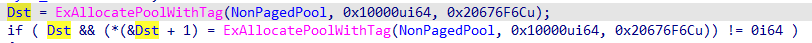
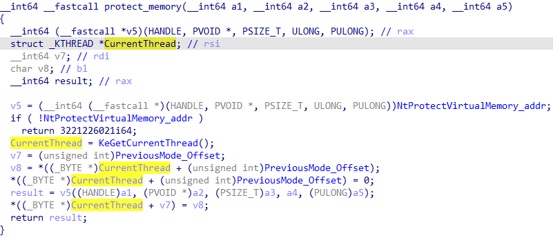

## NeacController

### 0x0 Background

> **Neac**: NetEase’s self-developed anti-cheat solution, designed to protect its PC games, including but not limited to Overwatch, Naraka: Bladepoint, and FragPunk.

A vulnerability in NetEase (Hangzhou) Network Co., Ltd NeacSafe64 Driver (versions prior to v1.0.0.8) allows a local attacker to escalate privileges via crafted IOCTL commands to the NeacSafe64.sys component, potentially enabling SYSTEM privilege acquisition and arbitrary shellcode execution in kernel space.

### 0x1 Escalation of Privileges

The NeacSafe64 driver exposes two message handlers (Opcode 14 and 70, **msghandler15**/**msghandler71**)  that implement **arbitrary kernel-space read/write** primitives. These  operations enable NeacController to perform privileged memory  manipulation, ultimately achieving SYSTEM privilege escalation through  combined exploitation of these capabilities.

### 0x2 Code Execution

The NeacSafe64 driver allocates **NonPagedPool** memory and stores its pointer in a global variable, subsequently utilizing function pointers to invoke system APIs. This implementation allows attackers to:

- Inject shellcode into the allocated pool memory.

- Hijack control flow by overwriting the function pointer.

  

- Trigger execution through specific Message Handler operations.

  

ultimately achieving arbitrary kernel-mode code execution (KMCE) via controlled pointer redirection.

### 0x3 Usage

Deploying the NeacSafe64 driver via NeacSafe64.inf and executing NeacController.exe, and it will spawn a privileged cmd process. **The EPROCESS structure varies across Windows versions. Developers must  manually update hardcoded offsets in source code to match their target  environment.**

The demonstration payload currently uses a single `ret` instruction as shellcode, resulting in no observable system behavior. For effective vulnerability validation:

1. Replace the placeholder shellcode with `0xCC` (INT3 breakpoint opcode)
2. Execution will then trigger either:
   - Debugger break-in via `STATUS_BREAKPOINT` exception
   - System crash (BSOD) if unhandled in kernel context